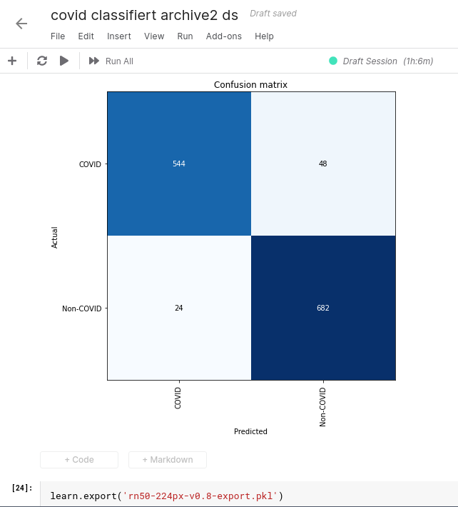

# covid-19-classifier

A [fastai2](https://www.fast.ai/) based Covid-19 classifier.

**Homepage**: https://labs.deep-insights.ai

# Summary

This Covid-19-classifier is a Deep Learning based image classifier which is able to categorize lung X-rays as well as CT Scans as either COVID-19, PNEUMONIA (which groups together MERS, viral pneumonia and other diseases), or as NORMAL (non-pathological) lungs scans.
Our **accuracy is 98.3%**. To the best of our knowledge this beats all previous Covid-19 lung radiology AI classifiers. 

Please see the [methodology page](https://labs.deep-insights.ai/methodology.html) for more details how we achieved this high detection rate.

# Accuracy





# Open Source

We believe that this project needs to be open source! Open source allows us to:
  * make sure you can reproduce our results
  * make sure that you can actively deploy our project in your country (without license fees) __in order to help patients now__
  * get constructive feedback from you (pull requests welcome!)
  * make sure you can validate our research
  * build on top of the best of the internet to further improve this project.
  
  
# Installation

## Prerequisites

required for training as well as inference (classification of images):
  * fastai2

if you want to run our jupyter notebook and train the model yourself:
  * jupyter notebook

Here is how to get started:

### Fastai2

At the moment of writing (April 2020) the easiest installation method for fastai version 2 is:
```bash
pip install fastai2
```
Later in 2020, with the release of the new [course](https://course.fast.ai/) on [fast.ai](https://www.fast.ai/) the original fastai library will be updated to version 2.
For more information and additional installation instructions (e.g. via conda) please see the github repos for:

[fastai](https://github.com/fastai/fastai)

[fastai version 2](https://github.com/fastai/fastai2)

### Jupyter notebooks

If you only want to use our model for inference you don't need Jupyter notebooks,
but if you want to play around with our training notebook and train the model yourself, perhaps on your own data
then we recommend jupyter notebook for quick experimentations.

To install jupyter notebooks please follow the [installation guides](https://jupyter.org/install) and make sure you can run jupyter notebooks.

# Running our code

## Training

Run the training notebook:
```bash
cd v0.4/
jupyter-notebook cov-19-training.ipynb

NOTE: if you want to train a model yourself we heavily recommend you have access to a GPU as this will speed up training times drastically compared to running on the CPU. Sadly currently only nVidia cards allow for easy deep learning on the GPU.
If you do not have access to a nVidia GPU we recommend a free service like [Kaggle](https://www.kaggle.com/) which gives anyone 30 hours of GPU compute time per week, which is more than enough to train a state of the art image classifier thanks to transfer learning.
```

## Inference (classifying images)

<xxx coming xxx>


## Server

<XXX coming XXX>

